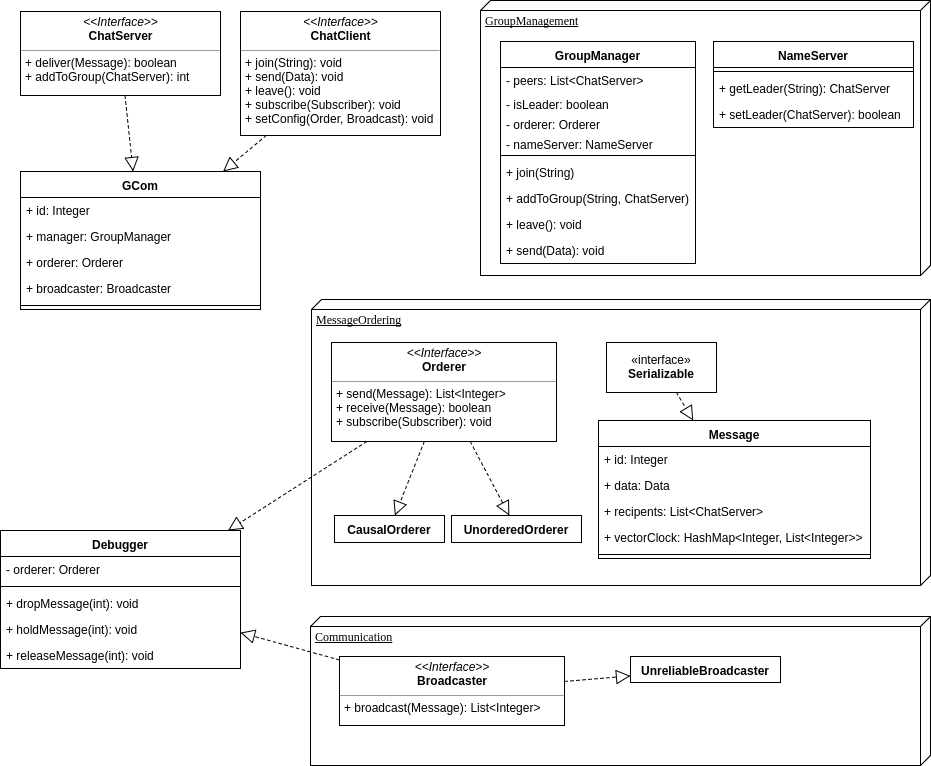

# The GCom project

**Structure**

**Timeline**

- **2017-12-06** Deliverable 1 (analysis and design) finished.
- **2017-12-08** Name server and basic unreliable multicast done as well as underlying structure (partially implemented classes for messages, group management, chat client).
- **2017-12-13** Message ordering done, debugger partially implemented.
- **2017-12-15** Group management finished, simple chat GUI and debugger done.
- **2017-12-19** GCOM library, debugger and chat application completed.
- **2017-12-20** Soft deadline for the project. Presentation preparations done.
- **2017-12-21** First possibility for presenting the project. Project presentation done.
- **2018-01-08** Hard deadline for the project.
- **2018-01-09** Final project presentation.
